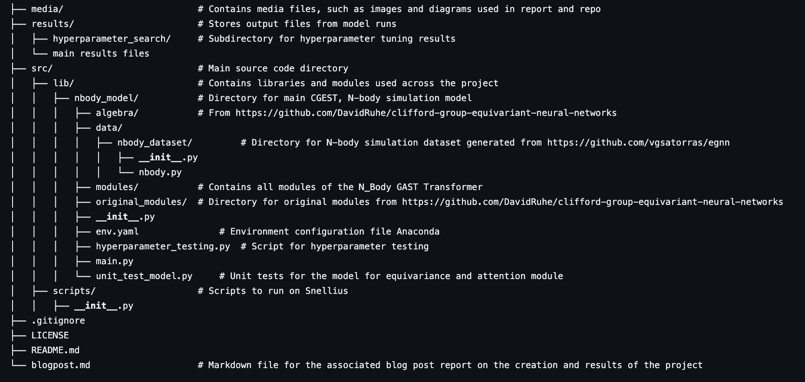

# Geometric Algebra Simplicial Transformer (GAST)

## Authors
This project was created by Bella Gardner, Krijn Dignum, Coen van den Elsen, Daan Heijke and Raoul Ritter

## Description
This repository contains code and resources for the "Clifford Group Equivariant Simplicial Transformers" (CGESTs) project. The project aims to develop a new class of equivariant transformers by leveraging simplicial complexes and Clifford algebra to achieve equivariance to the full symmetry group. The codebase includes implementations of the proposed model, experiments, and evaluation scripts.

We introduce an extension to the domain of geometric deep learning with CGESTs, enhancing the expressivity of Transformers to match that of Simplicial Message Passing Neural Networks (MPNNs). This facilitates efficient and scalable solutions for geometric graph data, including triangles and higher-level graph structures. Our model has been successfully implemented on the three-dimensional N-body problem, aiming to establish a foundation for broader applications in physics, chemistry, robotics, and computer vision. 

[//]: # (## Performance)

## Report
Find a detailed report on the project [here](/blogpost.md).

## Requirements
- Python 3.11+
- Anaconda or Miniconda
   
## Code Organization


## Installation
1. Clone the repository:
   ```bash
   git clone git@github.com:raoulritter/clifford-group-equivariant-simplicial-transformers.git 
   ```
2. Install the conda environment:
   ```bash
   conda env create -f src/lib/env.yaml
   conda activate cgest_env
   ```

3. Export your dataroot:
   ```bash
   export DATAROOT="/Users/clifford-group-equivariant-simplicial-transformers/src/lib/nbody_model/data/nbody_dataset/"
   ```
   This is based on the location where you download this repo. The data root is
   `./src/lib/nbody_model/data/nbody_dataset/` from the base of this repo. 

3. Run the main script:
   ```bash
   python nbody_main.py
   ```
   or use other scripts provided in the repository under *scripts*.


## Usage
To use the scripts, ensure you have installed the required dependencies and activated the conda environment. You can then run the main script or any other scripts provided in the repository.

For example, to run the main script:
```bash
python nbody_main.py
```
## Demo and Reproducibility
If you would like to reproduce the results of the experiments, you can run the scripts provided in the repository. The scripts are located in the `scripts` directory.
The pre-trained models are available in the `src/pretrained_models` directory.

## Data
Data for the n-body problem and other experiments can be found in the `src/lib/nbody_model/data/nbody_dataset` directory. 
Ensure that you have the necessary data files before running the scripts.
This data is generated from the EGNN repo [here](https://github.com/vgsatorras/egnn) using `python -u generate_dataset.py` the default parameters.

[//]: # (## References)

[//]: # (% TODO Fill in)
## Acknowledgements
We would like to thank Cong Liu for his help and guidance during this project, and David Ruhe for his great [implementation](https://github.com/DavidRuhe/clifford-group-equivariant-neural-networks) and paper on Clifford algebra. Their contributions and support were invaluable to the success of this project.

## Citation
If you use this code or find it helpful in your research, please cite it as follows:
```
@misc{,
  author = {Bella Gardner, Krijn Dignum, Coen van den Elsen, Daan Heijke and Raoul Ritter},
  title = {Geometric Algebra Simplicial Transformer (GAST)},
  year = {2024},
  publisher = {GitHub},
  journal = {GitHub Repository},
  howpublished = {\url{https://github.com/raoulritter/clifford-group-equivariant-simplicial-transformers/}}
}
```

## License
This project is licensed under the MIT License - see the [LICENSE](LICENSE) file for details.
```

