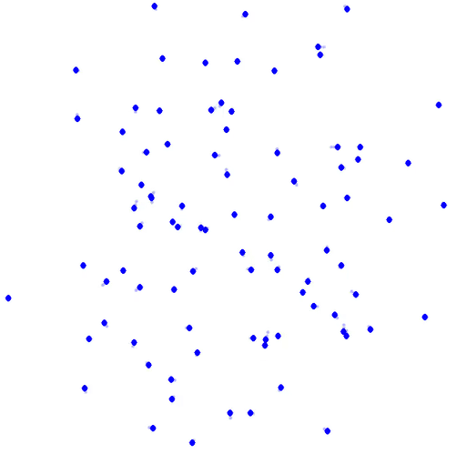
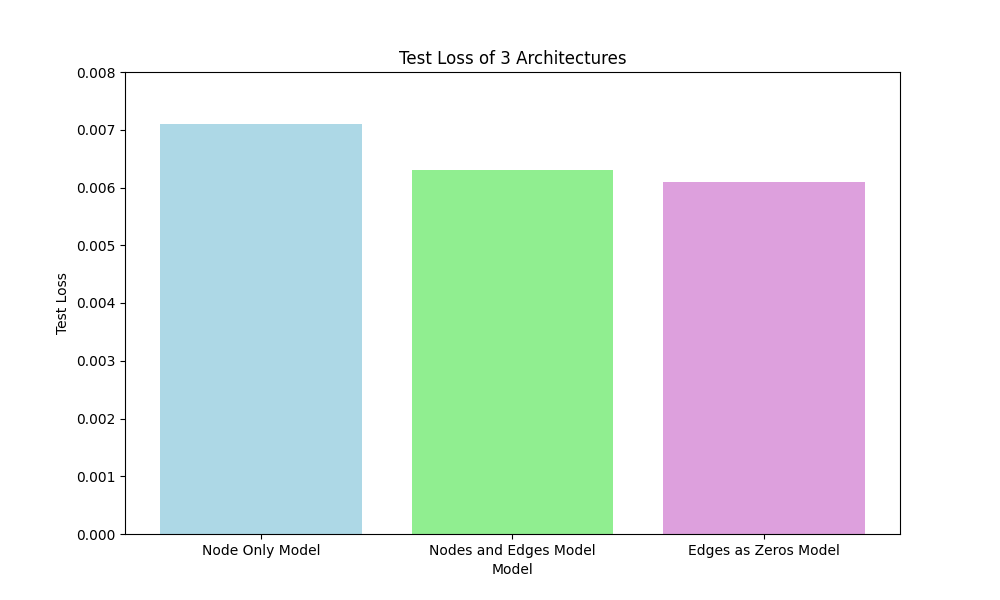

# Geometric Algebra Simplicial Transformer (GAST)


## 1. Introduction 

In this blog report, we introduce an extension to the domain of geometric deep learning: the Geometric Algebra Simplicial Transformer (GAST). Our research endeavors to enhance the expressivity of Transformers to match that of Simplicial Message Passing Neural Networks (MPNNs) while maintaining equivariance, thereby facilitating efficient and scalable solutions for geometric graph data encompassing triangles and higher-order graph structures.  By successfully implementing our model on the three-dimensional N-body problem, we aim to establish a foundation for its broader application in disciplines such as physics, chemistry, robotics, and computer vision, thereby fostering significant progress across these fields.  

|  |
|:--:|
|[(Liu et al., 2024)](https://arxiv.org/abs/2402.10011)|

### 1.1 The Problem

In scientific fields like chemistry, physics, biology, and social sciences, data is often represented using graph structures. These graphs contain geometric information and higher-order simplicial structures. Despite the importance of these complex structures, traditional Message Passing Neural Networks (MPNNs) struggle to utilize geometric information and higher-order simplicial structures. MPNNs are limited to pairwise interactions and face scalability issues as graph size increases. Scalability in Graph Neural Networks (GNNs) remains challenging for larger graphs due to higher computational demands and the complexity of maintaining effective neighborhood aggregations. This is especially problematic in applications like the three-dimensional N-body problem, where interactions grow exponentially with dimensionality ( $O(n^2)$ ). Traditional MPNNs are constrained to the expressiveness of the Weisfeiler-Lehman (1-WL) test, unable to detect complex graph structures like higher-dimensional triangles, as noted by [Xu et al. (2018)](https://arxiv.org/abs/1810.00826).

Our solution, GAST, integrates Geometric/Clifford algebra with the Transformer architecture to address these limitations. GAST facilitates the incorporation of simplicial structures within graph data while preserving scalability and equivariance to geometric transformations. Our model augments Transformers to rival or exceed the expressivity of E(n) equivariant message-passing simplicial networks (EMPSNs) while maintaining computational efficiency. This is achieved by developing an equivariant Transformer utilizing Clifford vectors and equivariant operators. Furthermore, we elevate the graph to the simplicial complex by initiating tokens for 1-simplices (and potentially higher-order simplices) that exclusively communicate with adjacent structures, in addition to node tokens that communicate with all nodes, akin to conventional Transformers.


### 1.2 The Dataset
|  |
|:--:|
|[(Medium, 2020)](https://medium.com/swlh/create-your-own-n-body-simulation-with-python-f417234885e9)|
To empirically evaluate our architecture, we apply it to a three-dimensional N-body problem. The N-body problem, a fundamental challenge in physics, involves predicting the motions of a group of particles that interact due to their charges, velocities, and locations in 3D space. The N-body problem is computationally intensive because the number of pairwise interactions grows exponentially with the number of particles. Each particle interacts with every other particle, leading to a combinatorial explosion of interactions that need to be calculated. Furthermore, high precision is required to accurately model these interactions over time, as small errors can compound and lead to significant deviations in the predicted motions.

Machine learning, particularly neural networks, offers a promising solution by approximating complex interactions more efficiently. Neural networks can learn from data to predict the outcomes of interactions, thus handling large datasets and making scalable, faster predictions. This approach allows for the modeling of intricate systems that would be computationally prohibitive with traditional methods.

The choice of the N-body problem for our empirical evaluation is strategic. It presents a classic challenge in physics, widely recognized and studied, making it an ideal benchmark for testing our model. By applying our GAST architecture to the N-body problem, we can critically assess its effectiveness in a well-understood scientific context. This dataset allows us to compare our results against established benchmarks and related studies, providing a robust platform for evaluating the performance and scalability of our approach.

We acknowledge that the dataset presents a limitation, as it lacks inherent simplicial structure. In our case, although we generate edges between all bodies, these structures do not encapsulate information beyond what is already contained in the nodes/bodies themselves. For instance, in scenarios such as teams with shared norms or rules, the collective properties differ from the individual characteristics of the members.


### 1.3 Aim and Research Question

The objective of this study is to demonstrate that GAST not only advances the theoretical capabilities of neural networks in utilizing complex graph structures but also underscores its practical utility across a range of scientific applications. Specifically, we aim to investigate whether the inclusion of both edges and nodes embeddings in GAST results in improved accuracy compared to models that utilize only node embeddings. This investigation will help assess the benefit of incorporating simplicial structure information within a more efficient architecture like a Transformer. By addressing this research question, we aim to substantiate the theoretical advancements and practical benefits of GAST in the context of neural network applications for complex graph analysis.


## 2. Preliminaries and Related Work
### 2.1 Related Work

Our project is informed by a series of advancements in the domain of graph neural networks and transformers, each addressing various limitations but also introducing new challenges. The related work can be organized by the three key features of our GAST model: (1) Simplicial Message Passing, (2) Equivariance, and (3) the Transformer architecture.

**(1) Simplicial Message Passing Networks**

Traditional Message Passing Neural Networks (MPNNs) are foundational yet constrained by the Weisfeiler-Lehman (1-WL) test, which limits their ability to detect complex structures such as higher-dimensional triangles. [Xu et al. (2018)](https://arxiv.org/abs/1810.00826) highlighted that MPNNs, while powerful, can only capture pairwise interactions effectively, thereby missing out on the richer structural information present in higher-order simplices. This limitation is particularly critical in applications requiring the modeling of multi-body interactions and complex topologies, such as in molecular chemistry and social network analysis.

Efforts to extend MPNN capabilities through Simplicial Message Passing Networks (SMPNs) have shown promise. By explicitly incorporating higher-order simplicial complexes into the message-passing framework, these networks can capture interactions at multiple levels of granularity, enabling more expressive representations of the data [(Bodnar et al., 2021)](https://proceedings.mlr.press/v139/bodnar21a/bodnar21a.pdf). However, these approaches often require extensive pre-computation of simplicial complexes, which can limit their scalability and applicability to large-scale datasets. Additionally, SMPNs can suffer from increased computational complexity and memory requirements due to the need to manage and process higher-dimensional structures, making them less efficient for real-time applications.

**(2) Equivariant Neural Networks**

Equivariant Message Passing Simplicial Networks (EMPSNs) have emerged as a powerful extension to traditional MPNNs, capable of managing higher-dimensional simplices while maintaining equivariance. Equivariance ensures that the network's output respects the symmetries of the input data, which is crucial for applications involving geometric transformations. Eijkelboom et al. (2023) demonstrated that EMPSNs can effectively handle higher-dimensional simplices by leveraging E(n) equivariant message passing. This allows EMPSNs to capture complex interactions within data that traditional MPNNs might miss. However, these networks often rely on manually calculated geometric data, which can impede scalability and efficiency, particularly when dealing with large and dynamically changing datasets.

Further developments in Clifford Group Equivariant Neural Networks (CGENNs) have significantly improved the handling of geometric transformations and complex structures. By utilizing steerable Clifford algebra, CGENNs achieve equivariance in a more flexible and scalable manner ([Ruhe et al., 2023](https://arxiv.org/abs/2302.06594); [Liu et al., 2024)](https://arxiv.org/abs/2402.10011)). These networks incorporate the principles of geometric algebra to handle transformations and interactions within data, providing a more robust framework for managing geometric complexities. CGENNs can efficiently process higher-dimensional data and maintain consistency under various transformations, thereby enhancing their applicability to a wide range of scientific and engineering problems.

Despite these advancements, both EMPSNs and CGENNs face challenges in balancing computational efficiency with the need for rich structural information. Ensuring that these networks can scale while preserving the intricate details of the data remains a critical area of research. Our work aims to build on these foundations by integrating the strengths of geometric algebra and transformer architectures to develop a novel approach that effectively addresses these challenges, offering enhanced scalability, expressivity, and practical utility in complex graph analysis.


**(3) Transformer Models**

The Transformer architecture has revolutionized many areas of machine learning due to its ability to capture long-range dependencies and its inherent scalability. Transformers excel in processing sequential data and have been effectively adapted for various tasks, including natural language processing, computer vision, and more recently, graph-based learning. Incorporating simplicial message passing into Transformers provides a powerful framework for modeling complex geometric structures, enabling the capture of rich, higher-order interactions that traditional architectures may miss.

The Geometric Algebra Transformer (GATr), proposed by [Brehmer et al. (2023)](https://proceedings.neurips.cc/paper_files/paper/2023/file/6f6dd92b03ff9be7468a6104611c9187-Paper-Conference.pdf), employs geometric algebra to achieve equivariance with enhanced efficiency. GATr leverages the rich algebraic structure of geometric algebra to perform transformations that are equivariant by design, thus maintaining the geometric integrity of the data throughout the learning process. This approach ensures that the learned representations respect the symmetries and invariances inherent in the data, which is particularly important for applications involving geometric transformations.

Previous research has also explored simplicial transformers using Clifford algebra to define triangular attention via geometric products [(Clift et al., 2019)](https://arxiv.org/pdf/1909.00668). These methods extend the attention mechanism to higher-order simplices, allowing for the capture of more complex interactions within the graph. The geometric product in Clifford algebra provides a natural way to handle higher-dimensional simplices, facilitating the modeling of multi-body interactions that are crucial in many scientific applications.

However, the computational complexity of these models remains a challenge, particularly when applied to large-scale datasets. The extension to higher-order simplices typically results in an $O(n^3)$ complexity, making these methods less practical for real-time or large-scale applications. Moreover, while these models use the geometric product to define interactions among more than two nodes, they do not achieve full equivariance. This lack of equivariance can limit their ability to generalize across different geometric transformations, reducing their overall effectiveness.

By combining simplicial message passing, equivariance, and the transformer architecture, GAST offers a powerful, scalable model for complex geometric graph analysis, advancing the capabilities of neural networks in handling rich structural information in higher-order simplices.


### 2.3 Preliminaries
#### 2.3.1  Clifford algebra
Clifford algebra, also known as geometric algebra, is a mathematical framework used to model geometric transformations. It extends the capabilities of traditional algebraic systems such as complex numbers and quaternions. The most important part about using geometric algebra is that it provides a framework where we can easily manipulate vectors in an O(n) equivariant way. There are four main operations to achieve this: (1) embedding vectors in Clifford space, (2) performing geometric products, (3) the linear operation for multivectors and (4) normalization and nonlinearity. Below we provide a short introduction to each of these. For more extensive background on the matter, we would like to refer to the paper of [Ruhe et al. (2023)](https://arxiv.org/abs/2302.06594). Now for the explanation of Clifford algebra itself:

**(1) Embedding Vectors in Clifford Space**

Clifford algebra consists of multiple subspaces, each representing different geometric entities. In three dimensions, these subspaces include:

- **Scalars**: Represent non-geometric features, such as charges.
- **Vectors**: Represent geometric features, such as positions and velocities.
- **Bivectors**: Represent oriented areas or planes, which can be used to describe rotations.
- **Trivectors**: Represent volumes.

By embedding data into these subspaces, we can capture a wide range of geometric and non-geometric properties. Besides that, lifting our input into Clifford space enables us to do certain operations while remaining equivariant. 

|  |
|:--:|
|[Ruhe et al. (2023)](https://arxiv.org/abs/2302.06594)|

#### 2.3.2  Geometric Products

The geometric product is the fundamental operation in Clifford algebra, combining the properties of the dot product and the wedge product. For two vectors $v_1$ and $v_2$, the geometric product is defined as:
$$v_1 v_2 = v_1 \cdot v_2 + v_1 \wedge v_2$$
where $v_1 \cdot v_2$ is the symmetric dot product and $v_1 \wedge v_2$ is the antisymmetric wedge product. This product allows us to combine different geometric entities and is associative but non-commutative, meaning $v_1 v_2 \neq v_2 v_1$.


**Example of Geometric Product** 

For sake of simplicity, let's constrain ourselves to a two-dimensional space and two vectors, $v_1$ and $v_2$, each with a scalar part.

Define the vectors as follows:
$$v_1 = s_1 + x_1 e_1 + y_1 e_2$$
$$v_2 = s_2 + x_2 e_1 + y_2 e_2$$

Here, $s_1$ and $s_2$ are the scalar parts, $x_1$ and $x_2$ are the components along the $e_1$ basis vector, and $y_1$ and $y_2$ are the components along the $e_2$ basis vector. The basis vectors $e_1$ and $e_2$ satisfy the following properties:
$e_1^2 = 1$, 
$e_2^2 = 1$ and 
$e_1 e_2 = -e_2 e_1.$

Now, compute the geometric product $v_1 v_2$:
$$v_1 v_2 = (s_1 + x_1 e_1 + y_1 e_2)(s_2 + x_2 e_1 + y_2 e_2)$$

Expanding the product, we get:
$$v_1v_2 = s_1 s_2 + s_1 x_2 e_1 + s_1 y_2 e_2 + x_1 e_1 s_2 + x_1 x_2 e_1 e_1 + x_1 y_2 e_1 e_2 + y_1 e_2 s_2 + y_1 x_2 e_2 e_1 + y_1 y_2 e_2 e_2$$

Using the properties of the basis vectors ($e_1 e_1 = 1$, $e_2 e_2 = 1$ and $e_1 e_2 = -e_2 e_1$), we simplify the terms:
$$v_1v_2 = s_1 s_2 + s_1 x_2 e_1 + s_1 y_2 e_2 + x_1 s_2 e_1 + x_1 x_2 + x_1 y_2 e_1 e_2 + y_1 s_2 e_2 + y_1 x_2 e_2 e_1 + y_1 y_2$$

Grouping similar terms, we get:
$$v_1v_2 = (s_1 s_2 + x_1 x_2 + y_1 y_2) + (s_1 x_2 + x_1 s_2) e_1 + (s_1 y_2 + y_1 s_2) e_2 + (x_1 y_2 - y_1 x_2) e_1 e_2$$

Here, the result consists of:
- A scalar part: $s_1 s_2 + x_1 x_2 + y_1 y_2$,
- A vector part along $e_1$: $(s_1 x_2 + x_1 s_2) e_1$,
- A vector part along $e_2$: $(s_1 y_2 + y_1 s_2) e_2$,
- A bivector part: $(x_1 y_2 - y_1 x_2) e_1 e_2$.

The scalar part is the result of the dot product, the rest of the wedge product. For more examples of the geometric product please refer to [Brandstetter et al., 2023](https://arxiv.org/pdf/2209.04934).

**Equivariance of the Dot Product:**

The dot product $\mathbf{a} \cdot \mathbf{b}$ of two vectors $\mathbf{a}$ and $\mathbf{b}$ is a measure of their similarity, capturing the cosine of the angle between them scaled by their magnitudes. The dot product is equivariant because it is invariant under rotations and reflections. This means that if we apply a rotation or reflection transformation $R$ to both $\mathbf{a}$ and $\mathbf{b}$, the dot product remains unchanged:
$$(R\mathbf{a}) \cdot (R\mathbf{b}) = \mathbf{a} \cdot \mathbf{b}$$
This property holds because the dot product depends only on the angle between the vectors and their magnitudes, both of which are preserved under orthogonal transformations.

**Equivariance of the Wedge Product:**

The wedge product $\mathbf{a} \wedge \mathbf{b}$ of two vectors $\mathbf{a}$ and $\mathbf{b}$ produces a bivector, which represents the oriented area spanned by the vectors. The wedge product is also equivariant because it transforms consistently under rotations and reflections. If we apply a rotation or reflection transformation $R$ to both $\mathbf{a}$ and $\mathbf{b}$, the wedge product transforms as follows:
$$R(\mathbf{a} \wedge \mathbf{b}) = (R\mathbf{a}) \wedge (R\mathbf{b})$$
This property holds because the wedge product captures the plane spanned by the vectors and its orientation, which are preserved under orthogonal transformations.


#### 2.3.3 Linear Layers for MultiVectors

In the Geometric Algebra Simplicial Transformer (GAST), the linear layers are designed to operate on multivectors, leveraging the concept of grade projections to handle the various components of these multivectors effectively. This allows for precise manipulation and transformation of geometric data, ensuring that the model maintains equivariance and captures complex interactions.

**Grade Projections in Linear Layers**

A multivector in Clifford algebra can be decomposed into components of different grades (scalars, vectors, bivectors, etc.). The linear layer in GAST uses grade projections to isolate and transform these components separately. This ensures that each grade component is handled appropriately according to its geometric properties.

Given a multivector $M$, the linear layer applies a transformation to each grade component of $M$. This transformation is parameterized by optimizable coefficients.

Consider a multivector $M$ expressed as:
$$M = \sum_{k=1}^n \langle M \rangle_k$$
where $\langle M \rangle_k$ denotes the grade-$k$ component of $M$.

The linear layer applies a separate transformation to each grade component. The output of each $k$-th grade component of one output vector is:

$$\langle M \rangle_{k.out} = \sum_{in=0}^{l} \phi_{k.out.in} \langle M \rangle_{k.in}$$


where $l$ is the number of input vectors, $\phi_{k.out.in} \in \mathbb{R}$ are the learnable parameters, $in$ and $out$ denote input and output channels, and $M \rangle_{k.in}$ is the grade-$k$ component of the input multivector $M_{in}$.


### Equivariance of Linear Layers for Multivectors

In Clifford algebra, a multivector can be composed of various grades, such as scalars, vectors, bivectors, and trivectors. We aim to show that a multivector linear layer is equivariant to rotations (this also works for reflections).

Let's consider a Clifford vector $\mathbf{M}$ represented as:
$$\mathbf{M} = \alpha \vec{V}_1 + \beta \vec{V}_2 + \gamma \vec{U}_1 + \delta \vec{U}_2$$

Here, $\alpha, \beta, \gamma, \delta$ are scalars (weights in the MVlinear operator), $\vec{V}_1, \vec{V}_2$ are vectors, and $\vec{U}_1, \vec{U}_2$ are bivectors. 1 and 2 refers to the clifford vector each belongs to (so $\vec{V}_1$ and $\vec{U}_1$ are parts of the same clifford vector.

To prove that the Clifford vector is rotation equivariant for $R$, we need to show that applying the rotation to the entire vector $\mathbf{M}$ yields the same result as rotating each component individually and then combining them.

### Step-by-Step Proof

1. **Initial combination of Clifford Vectors:**
   $$\mathbf{M} = \alpha \vec{V}_1 + \beta \vec{V}_2 + \gamma \vec{U}_1 + \delta \vec{U}_2$$

2. **Apply the Rotation Operator:**
   $$R(\mathbf{M}) = R(\alpha \vec{V}_1 + \beta \vec{V}_2 + \gamma \vec{U}_1 + \delta \vec{U}_2)$$

4. **Distribute the Rotation Operator Using Linearity:**
   $$R(\alpha \vec{V}_1 + \beta \vec{V}_2 + \gamma \vec{U}_1 + \delta \vec{U}_2) = \alpha R(\vec{V}_1) + \beta R(\vec{V}_2) + \gamma R(\vec{U}_1) + \delta R(\vec{U}_2)$$
   (This is possible because the rotation is a linear operation)

5. **Combine Rotated Components:**
   Let’s denote the rotated Clifford vector as $\mathbf{M}'$:
   $$\mathbf{M}' = \alpha R(\vec{V}_1) + \beta R(\vec{V}_2) + \gamma R(\vec{U}_1) + \delta R(\vec{U}_2)$$

Since:
$$\mathbf{M}' = R(\mathbf{M})$$


This demonstrates that the multivector linear layer is equivariant for the Clifford vector $(\mathbf{M})$. It shows that applying the rotation to the entire vector is equivalent to applying the rotation to each component individually and then combining the results. This property is crucial in understanding how rotations affect multivectors in Clifford algebra, ensuring that the geometric structure is preserved under rotation.

By utilizing grade projections in the linear layers, GAST can precisely transform each component of a multivector according to its grade. This approach ensures that the geometric properties of the data are preserved and that the model can capture complex interactions within the data. This capability is crucial for maintaining equivariance and achieving high performance in tasks that involve geometric data.

#### 2.3.4 Normalization and Non-linearity

**Scalar Subspace Non-Linearities:**
   For elements in the scalar subspace $Cl(0)(V, q)$, traditional non-linear activation functions like ReLU (Rectified Linear Unit) are applied. This is because the scalar subspace is invariant under the Clifford group's action, meaning applying a non-linearity to scalars won't disrupt equivariance.

   $$x^{(0)} \mapsto \text{ReLU}(x^{(0)})$$

**Non-Scalar Subspace Non-Linearities:**
   For elements in higher-grade subspaces (like vectors, bivectors, etc.), a gating mechanism is used, where the activation function modifies the element based on its magnitude while preserving directionality and equivariance. Specifically, the non-linearity applied is a sigmoid function of the form $\sigma(\beta n^2)$, where $\beta$ is a learnable parameter, and $n$ is the norm.

$$\sigma(\beta n^2) = \frac{1}{\exp(-\beta n^2) + 1}$$

   Thus, for each grade $m$:
   
$$x^{(m)} \mapsto \sigma(\beta_m \bar{q}(x^{(m)})) x^{(m)}$$

   Here, $\beta_m$ is a learnable parameter specific to grade $m$, and $\bar{q}$ is the extended quadratic form, which is invariant under the Clifford group's action. This ensures that the non-linearity preserves the equivariance property.

**Normalization**

Normalization is crucial for ensuring numerical stability and maintaining the properties of the geometric product. CGENNs implement a layer-wise normalization scheme:

**Subspace Normalization:**
   Each multivector subspace $Cl(m)(V, q)$ is normalized before computing geometric products. This normalization involves scaling the elements and multiplying by a learnable parameter $\alpha$:

$$
x^{(m)} \mapsto \alpha_m \frac{x^{(m)}}{\sigma(a_m)(\bar{q}(x^{(m)}) - 1) + 1}
$$

   Here, $\sigma$ is the logistic sigmoid function, and $a_m$ is a learnable scalar. This normalization ensures that the magnitudes of the elements are controlled, preventing numerical instabilities during the geometric product calculations.


** Relating to Equivariance and Invariance
Both operations are scalar products of the individual grades. Because the scalars are computed using the dot product of the grade with itself, this scalar is invariant to rotations and reflections. From the equivariance explanation for the linear layers for multivectors it follows that taking scalar multiples of individual grades in equivariant (we can see it as a linear layer between two vectors).

#### 2.3.4 Simpicial Message passing
|  |
| :--: |
| [(Wikipedia, n.d.)](https://en.wikipedia.org/wiki/Simplicial_complex) |


A simplicial graph (or simplicial complex) is a higher-dimensional generalization of a graph where not only vertices (0-simplices) and edges (1-simplices) are considered, but also higher-dimensional simplices like triangles (2-simplices), tetrahedrons (3-simplices), and so on. These simplices are connected in a manner that preserves their topological relationships.

Message passing on simplicial graphs involves the exchange of information between simplices to perform computations that reflect the topology and geometry of the underlying structure. The process can be summarized in the following steps:

Initialization:

1. Assign initial values or states to each simplex (e.g., scalar values, vectors, or more complex data structures). In the case of geometric graph data, we can initialize the higher order simplices in multiple ways, namely as geometric products or linear combinations (or both) of their adjacent structures. Another option would be to initialize it as zeroes and leave it up to the network to learn how to embed them.

2. For each simplex, compute messages to be sent to adjacent simplices. The message typically depends on the current state of the simplex and its neighbors. This can involve various operations, such as summation, averaging, or applying a more complex function.

3. Exchange messages between simplices. This step ensures that each simplex receives information from its adjacent simplices.
The adjacency can be defined in terms of the simplicial structure (e.g., sharing a common face).

4. Update the state of each simplex based on the received messages. This update can be a simple aggregation or a more sophisticated function incorporating the received information.

5. Repeat the message computation, passing, and update steps for a fixed number of iterations or until convergence.


### 3. Architecture
This architecture is designed to leverage the mathematical properties of Clifford algebra to process and interpret higher-dimensional relationships in data. The architecture consists of two main parts: Embedding Module and Transformer Layers (GAST Layers).

<!--  -->
|  |
|:--:|


#### 3.1 Embedding- Preparing N-Body

The embedding module is the initial stage where raw input data from the N-body dataset, information on nodes and edges, is transformed into a suitable input for the model. The embedding process starts with mean centering, where the mean of the point cloud is calculated and subtracted so that the positional data is centralized around the origin. By translating our input positions by subtracting the mean, we receive translation invariance, making our model E(n)-equivariant. 

The features of the bodies (nodes), including positions, velocities, and charges, are then lifted into the Clifford space. The invariants, such as charge, in the subspace $CL^{0}(\mathbb{R^d, q}) = \mathbb{R}$ and the covariants, such as positions and velocities, are embedded in the subspace $CL^{1}(\mathbb{R^d, q}) = \mathbb{R^d}$.

For edge features, there are two options. One way is to embed all information as zeroes, making the model learn features on its own. Another way is by making the edge features by combining  (1) adding the features of the adjacent nodes together, together with (2) the geometric products of the adjacent nodes, and (3) the original edge attributes from the dataset. Everything in clifford space is then passed through a linear layer, nodes and edges separate.

After making the embeddings, node and edge embeddings are concatenated and fed through an equivariant TwoLayerMLP before entering the transformer layers.

#### 3.2 Transformer Layers 

The GAST transformer layers are designed to handle multivector inputs and ensure equivariance. The architecture is similar to the original transformer block ([Vaswani, Ashish, et al., 2017.](https://arxiv.org/pdf/1706.03762)), with the difference that only equivariant operations are being used.

TODO: add architecture pictures

 ## 4. Methodology
In this study, we investigate the significance of edge information in enhancing the performance of NBodyTransformer models tasked with predicting future positions within such systems. Three distinct configurations were rigorously tested, each shedding light on the role of edge information:

1. Model Skipping Edge Information: Here, the model deliberately excludes edge information from its computations.
2. Model with Node and Edge Information: This configuration takes into account the edge information as described earlier
3. Model with Edges Initialized as Zero Vectors: In this setup, edges information is  initialized as zeros so that the model will learn these features by itself.

We describe our methodology in the following section. 

### 4.1 Dataset generation 
The dataset for [nobody](./src/lib/nbody_model/data) utilized in this study was generated using the [EGNN Repository](https://github.com/vgsatorras/egnn.git)
using the default values: ```--num-train 10000 --seed 43 --sufix small```.

The data consists of particle trajectories over a specified time interval. Each datapoint includes the initial positions $Loc \in \mathbb{R^{5 \times 3}}$, initial velocities $V \in \mathbb{R^{5 \times 3}}$ and charge values $C \in \{ +1, -0\}^{5}$. The data also inclides a tuple with edges in the graphs. Our model aims to predict the positions of particles after a certain time interval based on their initial states and interactions.


### 4.2 Experimental Setup

#### 4.2.1 Data Preparation 

The dataset for this study is managed using the NBodyDataset class, which handles train, validation, and test partitions. Each instance is initialized with parameters such as partition type, root directory, dataset suffix, and a maximum sample limit.

The load method reads .npy files for locations, velocities, edges, and charges. The preprocess method converts these arrays into PyTorch tensors, adjusts their dimensions, and generates edge attributes using the get_edges function. If a sample limit is set, the limit_samples method applies it.

For training and validation, the NBody class initializes datasets for each partition, and PyTorch’s DataLoader prepares data loaders with specified batch sizes and shuffling options, ensuring efficient batching and data access during training and evaluation.

#### 4.2.2 Training 
The training process began with initializing the NBodyTransformer models, each configured with hyperparameters determined through prior hyperparameter search. The dataset was divided into training, validation, and test sets, ensuring appropriate data access for each phase.

During training, models processed batches of training data through forward passes to generate predictions. The Mean Squared Error (MSE) loss function quantified the discrepancy between predicted and true values.

After calculating the loss, backpropagation computed gradients, indicating the adjustments needed for model parameters. The Adam optimizer, chosen for its adaptive learning rate, updated the parameters. Gradient clipping was applied to prevent exploding gradients, ensuring stable updates. A cosine annealing learning rate scheduler adjusted the learning rate dynamically, aiding in fine-tuning the model parameters for better convergence.

Early stopping was implemented to monitor validation performance and halt training if validation loss did not improve over a specified number of epochs (default 50), preventing overfitting and preserving the best model state.

The training spanned multiple epochs (default 1000), iteratively updating model parameters using a subset of training dataset (default 3000 samples). This iterative process allowed models to progressively improve predictions by minimizing the loss function. The model with the best validation loss was saved and used for testing.

#### 4.2.3 Evaluation 

The evaluation of the NBodyTransformer models involved several key steps to ensure a thorough and accurate assessment.

Equivariance testing was conducted by applying known transformations to the input data and verifying that the model's output transformations matched expectations. This process confirmed the model’s ability to maintain consistent predictions under geometric transformations.

The primary task of the NBodyTransformer is to predict future positions of nodes in an N-body system. The model generates these predictions by adding the output displacements to the initial positions.

Performance was evaluated using the Mean Squared Error (MSE) metric on both validation and test datasets, providing a measure of the average squared difference between predicted and actual positions. During training, validation loss was monitored to prevent overfitting, and the best-performing model parameters were saved.

To validate generalization, the saved best model was evaluated on the test dataset, ensuring predictive accuracy extends beyond the training and validation datasets.

## Results

To evaluate the performance of our Geometric Algebra Simplicial Transformer (GAST) model, we applied it to a three-dimensional N-body problem dataset, a fundamental challenge in physics that involves predicting the motions of particles interacting due to their charges, velocities, and locations in 3D space. We compared three different models: the Node Only Model, the Normal Standard Model, and the Model with Edges as Zeros. Each model was assessed based on its test loss to determine its accuracy and effectiveness in capturing the complex interactions within the dataset. The test losses for each model are summarized in Figure 1.


<div align="center">
  
</div>

The Node Only Model, which achieved a test loss of 0.0071, serves as a baseline in our comparative analysis. The test loss is relatively higher compared to the other models. The Node Only Model does not utilize higher-order simplices and thus yields the highest test loss. This aligns with the known limitations of traditional Message Passing Neural Networks (MPNNs), which often fail to account for higher-order structures and complex interactions beyond pairwise connections. This outcome highlights the model's limitations in capturing the intricacies of particle interactions in the N-body problem.

In contrast, the Nodes and Edges Model showed a marked improvement, achieving a test loss of 0.0063. By incorporating both node and edge information, this model was better equipped to capture interactions between particles. By embedding edges as higher-order simplices and using geometric products combined with aggregation of adjacent node attributes, it effectively modeled more complex interactions within the dataset. This approach allowed the model to capture the simplicial interactions that are crucial for accurately predicting particle movements in the N-body problem.

The Model with Edges as Zeros achieved the lowest test loss of 0.0061, indicating the highest accuracy among the models tested. By starting with zero edges, the model focuses on learning the most significant interactions and relationships from the data itself, rather than being influenced by predefined higher-order interactions. This approach minimises the risk of overfitting and ensures that the model captures only the most relevant and impactful features, thereby enhancing its generalisation and predictive capabilities.

The findings from our study underscore the critical role of simplicial information in accurately modelling interactions in complex datasets. The performance improvements observed from the Node Only Model to the Nodes and Edges Model, and further to the Model with Edges as Zeros, highlight the importance of effectively incorporating edge information. Specifically, the Edges as Zeros Model's approach of initializing edges as zero vectors facilitates the learning of significant interactions from scratch, leading to a more precise and robust understanding of the dataset.  Consequently, starting with a simpler, constrained representation allows the model to focus on the most relevant interactions, enhancing its generalisation and predictive capabilities. Overall, the GAST model, particularly when configured with edges initialized as zeros, demonstrates substantial promise for advancing the accuracy and robustness of predictions in the challenging domain of N-body problems.


## Conclusion

The findings from our study highlight the critical role of edge information in enhancing the performance of models predicting interactions in complex datasets. The Geometric Algebra Simplicial Transformer (GAST) model, particularly when configured with edges initialized as zeros, demonstrated the highest accuracy, achieving a test loss of 0.0061. This approach allows the model to learn significant interactions from scratch, reducing overfitting and improving generalization. Overall, our results underscore the importance of incorporating and effectively handling edge information to advance predictive accuracy in N-body problems.


### Evaluation 

One key area of improvement is the need for a broader and more systematic hyperparameter search. While our initial search covered a range of values, expanding this search space could reveal more optimal configurations to enhance model performance further.

Another point of criticism is the necessity for evaluating the model on more diverse datasets and conducting more comprehensive model comparisons. This would provide a clearer picture of GAST's performance relative to other state-of-the-art methods.

The model's complexity and the intricacies of implementing geometric algebra operations posed significant challenges, often leading to increased computational overhead and longer training times. Simplifying certain aspects of the implementation or optimizing the geometric product calculations could mitigate these issues, improving the model's efficiency. Additionally, a detailed analysis of the model's time and space complexity is needed to validate its scalability and practicality for large-scale applications.


### Future Work 

Future work will focus on several key enhancements to further refine the GAST model. A main avenue of improvement is the separation of scalar and multivector components. The multivectors are treated as is in the model now, while an MLP can be used on the scalars. This keeps the model equivariant and will increase the expressivity of the model, as an MLP introduces more complexity than the MVlinear.

Besides that, incorporating charge as an edge attribute is a promising strategy to enrich the model's ability to capture the dynamics of particle interactions. This charge information would then be removed from the node embeddings. This change could lead to more nuanced predictions and a deeper understanding of the forces at play within the N-body system when it comes to simplices.

Finally, expanding the scope of the model's applications beyond the N-body problem to other complex physical systems or higher-dimensional datasets could demonstrate the generalizability and robustness of the GAST model. By addressing these areas, we hope to push the boundaries of geometric deep learning and its applications in scientific computing.


## References

1. Bodnar, C., Frasca, F., Wang, Y. G., Otter, N., Montúfar, G., Liò, P., & Bronstein, M. (2021). Weisfeiler and Lehman go topological: Message passing simplicial networks.

2. Brandstetter, J., van den Berg, R., Welling, M., & Gupta, J. K. (2023). Clifford neural layers for PDE modeling.

3. Brehmer, J., de Haan, P., Behrends, S., & Cohen, T. (2023). Geometric algebra transformer.

4. Clift, J., Doryn, D., Murfet, D., & Wallbridge, J. (2019). Logic and the 2-simplicial transformer.

5. Eijkelboom, F., Hesselink, R., & Bekkers, E. (2023). E(n) equivariant message passing simplicial networks.

6. Liu, C., Ruhe, D., Eijkelboom, F., & Forré, P. (2024). Clifford group equivariant simplicial message passing networks.

7. Ruhe, D., Brandstetter, J., & Forré, P. (2023). Clifford group equivariant neural networks. *Advances in Applied Mathematics*, 45(1), 89-102.

8. Xu, K., Hu, W., Leskovec, J., & Jegelka, S. (2019). How powerful are graph neural networks?

9. Create Your Own N-Body Simulation with Python. (2020, September 14). Retrieved from [https://medium.com/swlh/create-your-own-n-body-simulation-with-python-f417234885e9](https://medium.com/swlh/create-your-own-n-body-simulation-with-python-f417234885e9)

10. Simplicial Complex. (n.d.). In *Wikipedia*. Retrieved from [https://en.wikipedia.org/wiki/Simplicial_complex](https://en.wikipedia.org/wiki/Simplicial_complex)


## Appendix
### Training Procedure
1. Hyperparameters
- Input Dimension: 3
- Model Dimension (d_model): 16
- Number of Heads: 8
- Number of Layers: 4
- Batch Size: 100
- Number of Samples: 3000
- Learning Rate: 0.005
- Weight Decay: 0.0001

2. Loss Function and Optimizer: The model uses Mean Squared Error (MSE) loss and the Adam optimizer.

3. Learning Rate Scheduler: A Cosine Annealing learning rate scheduler adjusts the learning rate based on the epoch number.

4. Training Loop:
- Epochs: 1000 epochs.
- Early Stopping


### Hyperparameter Tuning
To maximize the performance of GAST, we conducted hyperparameter optimization using Optuna, a framework for automated hyperparameter tuning. The objective is to minimize the models validation loss. The hyperparameters and their search ranges include:

- `d_model`: \{ $16, 32, 64, 128$ \} – dimensions of the model
- `num_heads`:  \{ $4, 8, 16$ \} – number of attention heads
- `num_layers`:  \{ $1, 8$ \} – number of transformer layers
- `lr` :  \{ $1e-5, 1e-3$
\} (log scale) – learning rate
- `batch_size`: \{
  $50, 100, 150, 200$
  \}
- `wd`:  \{
  $1e-6, 1e-2$
  \} (log scale) – weight decay

We tested three different configurations to explore the impact of edge information on model performance: one where the model accepts regular edge information, another where the model completely skips edge information, and a third where the edges are initialized as zero vectors.

The results are as follows:

**Model with edges (10):**<br>
Best Hyperparameters: {`d_model`: $128$, `num_heads`: $4$, `num_layers`: $4$, `lr`: $0.00035$, `batch_size`: $50$, `wd`: $2.34e-06$}<br>
Best Validation Loss: $0.0110$

**Model with edges (10):**<br>
Best Hyperparameters: {`d_model`: $64$, `num_heads`: $4$, `num_layers`: $2$, `lr`: $0.00087$, `batch_size`: $50$, `wd`: $9.92e-06$}<br>
Best Validation Loss: $0.0126$

**Model with edges (10):**<br>
Best Hyperparameters: {`d_model`: $128$, `num_heads`: $4$, `num_layers`: $2$, `lr`: $0.00068$, `batch_size`: $50$, `wd`: $7.04e-06$}<br>
Best Validation Loss: $0.0107$

