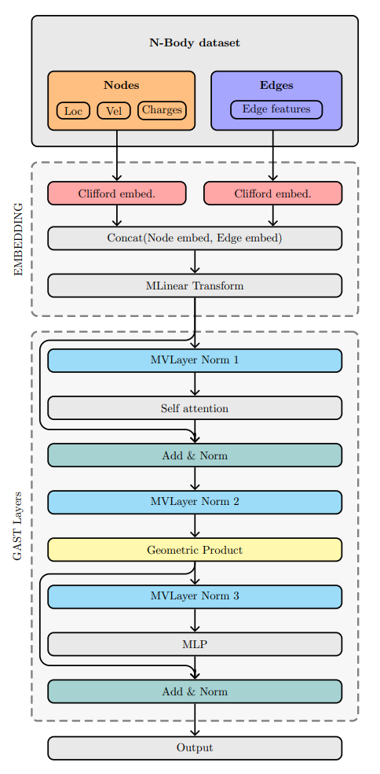

## 1. Introduction 
#### 1.1 Intro to project
In this blog report, we introduce an extension to the domain of geometric deep learning: the Clifford Group Equivariant Simplicial Transformers (CGESTs). Our research endeavors to enhance the expressivity of Transformers to match that of Simplicial Message Passing Neural Networks (MPNNs), thereby facilitating efficient and scalable solutions for geometric graph data encompassing triangles and higher-level graph structures.  By successfully implementing our model on the three-dimensional N-body problem, we aim to establish a foundation for its broader application in disciplines such as physics, chemistry, robotics, and computer vision, thereby fostering significant progress across these fields.  

#### 1.2 Intro to problem/our solution 
The principal challenge addressed by our research is rooted in the inherent limitations of traditional Message Passing Neural Networks (MPNNs), which are unable to detect complex graph structures such as higher-dimensional triangles. Additionally, our project specifically addresses a critical challenge in the field of geometric deep learning: the need for scalability in the face of high-dimensional exponential search space optimization problems. Scalability in Graph Neural Networks (GNNs) remains a significant challenge, as their performance often degrades when applied to larger graphs due to increased computational demands and the complexity of maintaining effective neighborhood aggregations across extensive network structures. 

Traditional approaches to managing complex graph data, particularly in configurations such as the N-body problem where interactions between elements grow exponentially with dimensionality, often falter under the computational weight. This results in inefficiencies that render these traditional models impractical for large-scale applications or real-time processing. Our solution, the CGEST, leverages Clifford algebra to surpass these constraints, enabling the detection and processing of intricate topologies within graph data. Our model equips Transformers with the capability to rival and potentially surpass the expressivity of Simplicial MPNNs while maintaining scalability and computational efficiency.

#### 1.3 Dataset/problem
To empirically evaluate our architecture, we apply it to a three-dimensional N-body problem. The N-body problem, a fundamental challenge in physics, involves predicting the motions of a group of celestial objects interacting with each other gravitationally.  The N-body problem is computationally intensive due to the exponential growth of pairwise interactions and the high precision required, making traditional algorithms inefficient for large systems. Machine learning, particularly neural networks, becomes a necessity as it can approximate complex gravitational interactions more efficiently, allowing for scalable and faster predictions with large datasets. This choice of dataset is strategic, as the problem presents a classic challenge in physics and offers a robust platform for testing our model against established benchmarks. It allows us to critically assess the effectiveness of our approach in a well-understood scientific context.

#### 1.4 Expectation/Aim
Our objective is to demonstrate that the CGEST not only advances the theoretical capabilities of neural networks in recognizing and processing complex graph structures but also underscores its practical utility in a range of scientific applications. We anticipate that, compared to previous models, our approach will not only yield an improvement in accuracy and a reduction in error but also demonstrate enhanced efficiency in terms of computational resource utilization and processing speed.

#### 1.5 Related Work
Our project is informed by a series of pivotal advancements in the domain of graph neural networks, each addressing various limitations but also introducing new challenges. Traditional Message Passing Neural Networks (MPNNs) are foundational yet constrained by the Weisfeiler-Lehman (1-WL) test, which limits their ability to detect complex structures such as higher-dimensional triangles, as noted by Xu et al. [\citeA{xu2018powerful}]. Efforts to extend MPNN capabilities through E(n) Equivariant Message Passing Simplicial Networks have shown promise in managing higher-dimensional simplices, though they are limited by the need for manually calculated geometric data, which can impede scalability [\cite{eijkelboom2023n}]. Further developments in Clifford Group Equivariant Neural Networks, which utilize steerable Clifford algebra, have significantly improved the handling of geometric transformations and complex structures [\citeA{ruhe2024clifford}; \cite{liu2024clifford}]. Alongside, the Geometric Algebra Transformer (GATR) proposed by Brehmer (2023) employs geometric algebra to achieve equivariance with enhanced efficiency [\citeA{brehmer2023geometric}]. Previous research has also explored simplicial transformers using Clifford algebra to define triangular attention via geometric products, albeit resulting in high computational complexity [\citeA{DBLP:journals/corr/abs-1909-00668}]. These insights have been crucial in shaping our novel approach, which seeks to embed a subset of possible edges and treat these edges as tokens to mitigate computational overhead while maintaining or enhancing model expressiveness and efficiency.

## Architecture
This architecture is designed to leverage the mathematical properties of Clifford algebra to process and interpret higher-dimensional relationships in data. The architecture consists of two main parts: Embedding Module and Transformer Layers (GAST Layers).

#### 2.1 Embedding- Preparing N-Body
The embedding module serves as the initial stage where raw input data from the N-body dataset, including nodes and edges, is transformed into a suitable format for the transformer layers. This process involves several key steps, leveraging Clifford algebra to embed both scalar and vector features of each node in a geometric framework.

The embedding process starts with mean centering, where the mean of the point cloud is calculated and subtracted from each point to ensure the data is normalized around the origin.  Next, the 3D tensor data is flattened into a 2D tensor, changing the shape from (batch, nodes, dim) to (batch * nodes, dim). Flattening simplifies the data structure, making it easier to process in subsequent layers.

Each data point, including positions, velocities, and charges, is then embedded into the Clifford algebra space. Scalar features are embedded in the subspace $CL^{0}(\mathbb{R^d, q}) = \mathbb{R}$, which is the subspace of all scalars. Vector features are embedded in the subspace $CL^{1}(\mathbb{R^d, q}) = \mathbb{R^d}$ representing the vector subspace.

After embedding, the scalar and vector features are concatenated and transformed through an MVLinear layer, projecting the data into a 16-dimensional Clifford algebra space. This step ensures that both node and edge information are cohesively processed, preparing them for the transformer layers.

#### 2.2 Transformer Layers (GAST)
The core of the CGEST architecture is the transformer layers, specifically designed to handle multivector inputs and ensure equivariance. These layers include several components:

First, the MVLayer Normalization normalizes multivector inputs. Next, the self-attention mechanism computes attention scores for the nodes and edges within the graph. Our attention mask within the self attention  is initialized with zeros for a single batch, allowing nodes to attend to themselves and all other nodes within the same graph. Additionally, edges can attend to their corresponding nodes, and nodes can attend to their corresponding edges.
The mask is converted to a float, with masked positions set to negative infinity and allowed positions set to zero. The diagonal of the attention mask is set to negative infinity to prevent self-loops. The self-attention layer calculates the attention weights using these masks and applies them to the value matrix to produce the attended output. This attended output is then combined with the original input through an Add & Norm layer. Following the self-attention mechanism, a Clifford algebra geometric product is applied. 

The transformer block also includes a multilayer perceptron (MLP) that further processes the information. The MLP consists of MVLinear layers and  a MVSiLU activation function, introducing non-linearity. Finally the output of the MLP is combined with the previous output of the geometric product through another Add & Norm layer.

## Methodology 
#### Experimental setup
- Baseline Models comparison

#### Dataset Preparation
1. **Data Collection**: The dataset includes multiple attributes for nodes and edges, such as location, velocity, edge attributes, and charges, along with the location of targets.
2. **Preprocessing**: 
- Mean Centering: Each point cloud's mean is computed and subtracted from the coordinates to center the data at the origin.

- Flattening Tensors: The input tensors (locations, velocities, charges) are flattened to streamline processing.

- Edge Handling: Edges and edge attributes are generated from adjacency matrices using the get_edges function, ensuring no self-loops and preparing them for further embedding.

#### Model architecture
1. Clifford Algebra Initialization
2. Embedding Layers
3. Transformer Blocks:

#### Inference and Evaluation
- Output Prediction: The model predicts new positions of the nodes by adding the output locations to the initial locations.
- Performance Metrics: The model's performance is evaluated using MSE on the validation and test datasets. The best model parameters are saved when the validation loss improves.

#### Attention Mechanism

## Results
Results of your work (link that part with the code in the jupyter notebook) 
- Our work compared to other models for error
- Our work compared to other models for resource utilization- Memory Usage
- Our work in training and querying runtime- Time Complexity
- To argue scalability - test with N - 1, N, N+1

## Conclusion
- Conclude Results
- Evaluation
- Future Work 

## Apendix
#### Training Procedure (should this go in the appendix?)
1. Hyperparameters
- Input Dimension: 3
- Model Dimension (d_model): 16
- Number of Heads: 8
- Number of Layers: 4
- Batch Size: 100
- Number of Samples: 3000
- Learning Rate: 0.005
- Weight Decay: 0.0001

2. Loss Function and Optimizer: The model uses Mean Squared Error (MSE) loss and the Adam optimizer.

3. Learning Rate Scheduler: A Cosine Annealing learning rate scheduler adjusts the learning rate based on the epoch number.

4. Training Loop:
- Epochs: 1000 epochs.
- Early Stopping

## Resources
