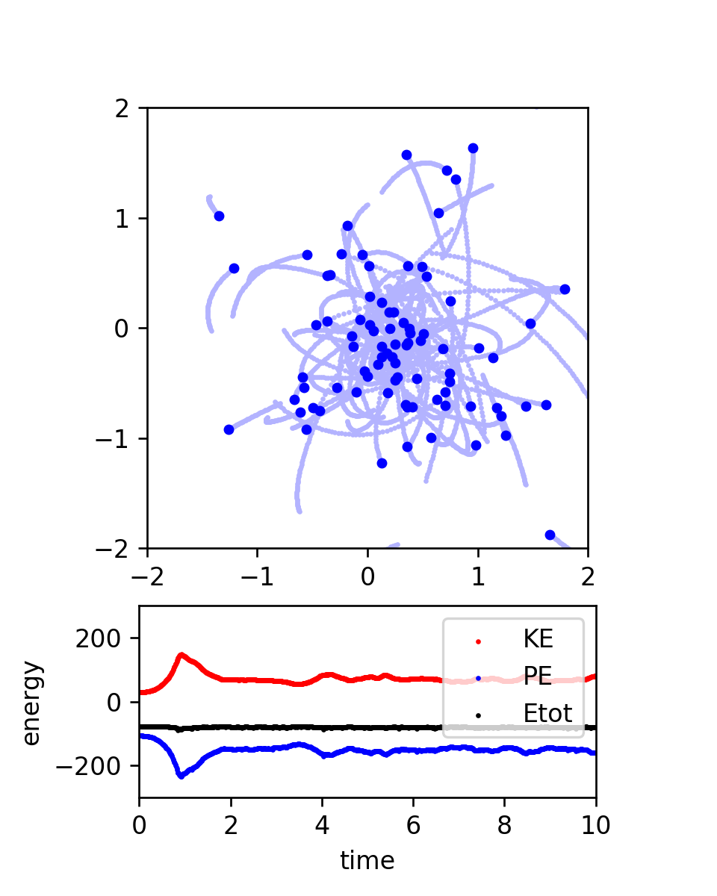
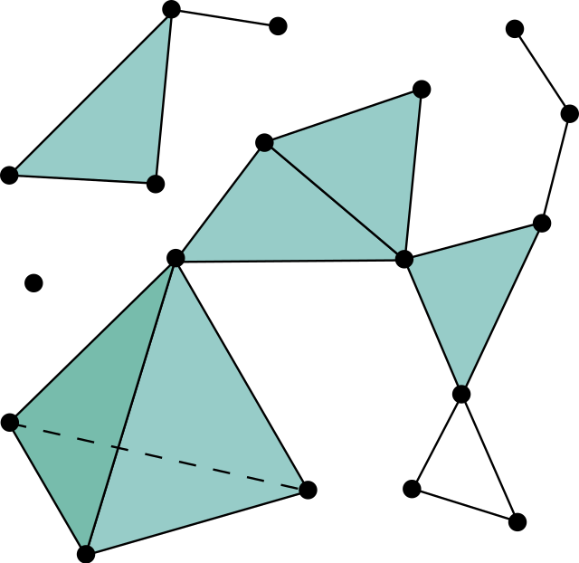
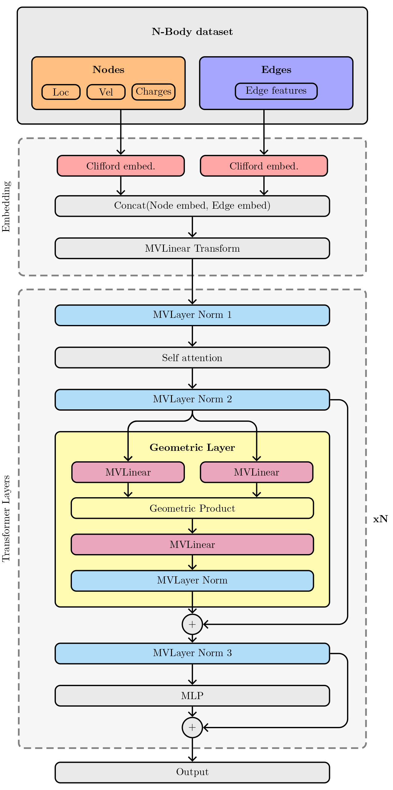
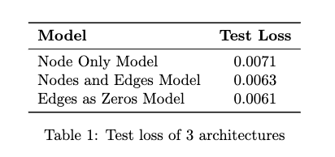

# Geometric Algebra Simplicial Transformer (GAST)


## 1. Introduction 
### 1.1 Intro to project
In this blog report, we introduce an extension to the domain of geometric deep learning: the Geometric Algebra Simplicial Transformer (GAST). Our research endeavors to enhance the expressivity of Transformers to match that of Simplicial Message Passing Neural Networks (MPNNs) while maintaining equivariance, thereby facilitating efficient and scalable solutions for geometric graph data encompassing triangles and higher-order graph structures.  By successfully implementing our model on the three-dimensional N-body problem, we aim to establish a foundation for its broader application in disciplines such as physics, chemistry, robotics, and computer vision, thereby fostering significant progress across these fields.  

|  |
|:--:|
|(Liu et al., 2024)|

### 1.2 The Problem
In various fields such as chemistry, physics, biology, and social sciences, data can be represented as a graph. The graph structures often contain geometric information and higher order simplicial structures, which can present significant challenges for traditional computational models. For polymer chains in chemistry the geometric information of atoms (0-simplices) can be locations in 3D space. For social networks people (0-simplices) can have locations on a map. Atoms and people can also contain non-geometric information such as charge in the case of atoms or haircolour for humans. Examples of higher order simplicial structures can be bonds between two (1-simplices) or more atoms (higher order-simplices) or friendships (1-simplices) and friendgroups in social networks (higher order simplices). In the case of social networks, understanding these higher-order interactions is essential for applications such as community detection, information diffusion, and recommendation systems. For polymers, modeling the interactions between atoms accurately is crucial for understanding and predicting the physical and chemical properties, which has implications for material science, drug design, and nanotechnology.


Despite the importance of these complex structures, traditional Message Passing Neural Networks (MPNNs) fall short in using geometric information and higher-order simplicial structures. MPNNs are limited to pairwise interactions and struggle with scalability as the size of the graphs increase. Scalability in Graph Neural Networks (GNNs) remains a significant challenge when applied to larger graphs, due to increased computational demands and the complexity of maintaining effective neighborhood aggregations across extensive network structures. This limitation becomes even more pronounced in applications such as the three-dimensional N-body problem--an example of a fully connected graph--where interactions grow exponentially with dimensionality ( O(n^2) ).


Our solution, GAST, leverages Geometric/Clifford algebra in combination with the Transformer architecture to surpass these constraints, enabling the use of simplicial structure within graph data, while maintaining scalability and equivariance to geometric transformations. Our model equips Transformers with the capability to rival and potentially surpass the expressivity of E(n) equivariant message passing simplicial networks (EMPSNs) while maintaining computational efficiency. We do this by making Transformers equivariant through the use of clifford vectors and equivariant operators. Next to that, we lift the graph to the simplicial complex by initiating tokens for the 1- (and possibly higher) simplices, that can only pass messages to -and receive from- their adjacent structures. This is additional to the tokens for nodes, which can pass and receive from all nodes, just as in regular Transformers. COEN


### 1.3 The Dataset
|  |
|:--:|
|(Medium, 2020)|
To empirically evaluate our architecture, we apply it to a three-dimensional N-body problem. The N-body problem, a fundamental challenge in physics, involves predicting the motions of a group of particles interacting with each other because of their charges, velocities and locations in 3D space. The N-body problem is can be computationally intensive due to the exponential growth of pairwise interactions and the high precision required, making traditional algorithms inefficient for large systems. Machine learning, particularly neural networks, becomes a necessity as it can approximate complex interactions more efficiently, allowing for scalable and faster predictions with large datasets. This choice of dataset is strategic. On one hand it presents a classic challenge in physics. On the other hand, it is used in related studies and therefore offers a robust platform for testing our model against established benchmarks. It allows us to critically assess the effectiveness of our approach in a well-understood scientific context.


We do acknowledge that the dataset also has a downside. Namely, it does not have inherent simplicial structure. Although we create these -edges between all bodies in our case- these structures do not contain information that is not present in the nodes/bodies themselves. An example of where this would be the case are shared norms/rules in teams that are different from the individual norms of people. We can, however, create unique edge information in our dataset by modeling the forces between nodes as an edge attribute, derived from charges of individual nodes. We can then discard the charge information in nodes to provide the edges with information that is not present in the nodes themselves. Because of limited time we leave this for further research.


### 1.4 The Aim
Our objective is to demonstrate that GAST not only advances the theoretical capabilities of neural networks in using complex graph structures but also underscores its practical utility in a range of scientific applications. We anticipate that, compared to previous models, our approach will yield an improvement in accuracy.


### 1.5 Related Work

Our project is informed by a series of pivotal advancements in the domain of graph neural networks and transformers, each addressing various limitations but also introducing new challenges. The related work can be organized by the three key features of our GAST model: (1) Simplicial Message Passing, (2) Equivariance, and (3) the Transformer architecture.

**(1) Simplicial Message Passing**

Traditional Message Passing Neural Networks (MPNNs) are foundational yet constrained by the Weisfeiler-Lehman (1-WL) test, which limits their ability to detect complex structures such as higher-dimensional triangles. Xu et al., 2019 highlighted that MPNNs, while powerful, can only capture pairwise interactions effectively, thereby missing out on the richer structural information present in higher-order simplices. This limitation is particularly critical in applications requiring the modeling of multi-body interactions and complex topologies, such as in molecular chemistry and social network analysis.

Efforts to extend MPNN capabilities through Simplicial Message Passing Networks have shown promise. By explicitly incorporating higher-order simplicial complexes into the message-passing framework, these networks can capture interactions at multiple levels of granularity, enabling more expressive representations of the data (Bodnar et al., 2021). However, these approaches often require extensive pre-computation of simplicial complexes, which can limit their scalability and applicability to large-scale datasets.

**(2) Equivariance**

Equivariant Message Passing Simplicial Networks (EMPSNs) have emerged as a powerful extension to traditional MPNNs, capable of managing higher-dimensional simplices while maintaining equivariance. Equivariance ensures that the network's output respects the symmetries of the input data, which is crucial for applications involving geometric transformations. Eijkelboom et al.,
2023 demonstrated that EMPSNs can effectively handle higher-dimensional simplices by leveraging E(n) equivariant message passing. However, these networks often depend on manually calculated geometric data, which can impede scalability and efficiency.

Further developments in Clifford Group Equivariant Neural Networks (CGENNs) have significantly improved the handling of geometric transformations and complex structures. By utilizing steerable Clifford algebra, CGENNs achieve equivariance in a more flexible and scalable manner  (Ruhe et al., 2023);  (Liu et al.,
2024). These advancements highlight the potential of geometric algebra to enhance the expressivity and performance of equivariant neural networks.

**(3) Transformer Architecture**

The Transformer architecture has revolutionized many areas of machine learning due to its ability to capture long-range dependencies and its inherent scalability. Incorporating simplicial message passing into Transformers provides a powerful framework for modeling complex geometric structures.

The Geometric Algebra Transformer (GATR) proposed by Brehmer (2023) employs geometric algebra to achieve equivariance with enhanced efficiency  (Brehmer et al., 2023). GATR leverages the rich algebraic structure of geometric algebra to perform transformations that are equivariant by design, thus maintaining the geometric integrity of the data throughout the learning process.

Previous research has also explored simplicial transformers using Clifford algebra to define triangular attention via geometric products (Clift et al., 2019). These methods extend the attention mechanism to higher-order simplices, allowing for the capture of more complex interactions within the graph. However, the computational complexity of these models remains a significant challenge, particularly when applied to large-scale datasets ( $O(n^3)$ ). Although these methods do use the geometric product to define a product of more than two nodes, these models are not equivariant.


**Integrating the Three Features in GAST**

Our Geometric Algebra Simplicial Transformer (GAST) model aims to integrate these three features -Simplicial Message Passing, Equivariance, and the Transformer architecture- into a cohesive and scalable framework. By embedding vectors in Clifford space and utilizing equivariant operators, GAST ensures that the geometric properties of the data are preserved. Additionally, by initiating tokens for higher-order simplices and implementing hierarchical message passing, GAST can capture intricate topologies and interactions within the graph data.

This integrated approach not only addresses the limitations of traditional MPNNs but also leverages the strengths of geometric algebra and transformers to create a powerful and scalable model capable of handling complex geometric graph data, such as polymer chains in chemistry and social networks in social sciences.


## 2. Background
### 2.1 Clifford algebra
Clifford algebra, also known as geometric algebra, is a mathematical framework used to model geometric transformations. It extends the capabilities of traditional algebraic systems such as complex numbers and quaternions. The most important part about using geometric algebra is that it provides a framework where we can easily manipulate vectors in an E(n) equivariant way. There are four main operations to achieve this: (1) embedding vectors in Clifford space, (2) performing geometric products, (3) the linear operation for multivectors and (4) normalization and nonlinearity. Below we provide a short introduction to each of these. For more extensive background on the matter, we would like to refer to the paper of [Ruhe et al. (2023)](https://arxiv.org/abs/2302.06594). Now for the explanation of Clifford algebra itself:

#### (1) Embedding Vectors in Clifford Space

Clifford algebra consists of multiple subspaces, each representing different geometric entities. In three dimensions, these subspaces include:

- **Scalars**: Represent non-geometric features, such as charges.
- **Vectors**: Represent geometric features, such as positions and velocities.
- **Bivectors**: Represent oriented areas or planes, which can be used to describe rotations.
- **Trivectors**: Represent volumes.

By embedding data into these subspaces, we can capture a wide range of geometric and non-geometric properties.

|  |
|:--:|
|(Ruhe et al., 2023)|

#### (2) Geometric Products

The geometric product is the fundamental operation in Clifford algebra, combining the properties of the dot product and the wedge product. For two vectors $v_1$ and $v_2$, the geometric product is defined as:
$$v_1 v_2 = v_1 \cdot v_2 + v_1 \wedge v_2$$
where $v_1 \cdot v_2$ is the symmetric dot product and $v_1 \wedge v_2$ is the antisymmetric wedge product. This product allows us to combine different geometric entities and is associative but non-commutative, meaning $v_1 v_2 \neq v_2 v_1$.


**Example of Geometric Product** 

For sake of simplicity, let's constrain ourselves to a two-dimensional space and two vectors, $v_1$ and $v_2$, each with a scalar part.

Define the vectors as follows:
$$v_1 = s_1 + x_1 e_1 + y_1 e_2$$
$$v_2 = s_2 + x_2 e_1 + y_2 e_2$$

Here, $s_1$ and $s_2$ are the scalar parts, $x_1$ and $x_2$ are the components along the $e_1$ basis vector, and $y_1$ and $y_2$ are the components along the $e_2$ basis vector. The basis vectors $e_1$ and $e_2$ satisfy the following properties:
$e_1^2 = 1$, 
$e_2^2 = 1$ and 
$e_1 e_2 = -e_2 e_1.$

Now, compute the geometric product $v_1 v_2$:
$$v_1 v_2 = (s_1 + x_1 e_1 + y_1 e_2)(s_2 + x_2 e_1 + y_2 e_2)$$

Expanding the product, we get:
$$v_1v_2 = s_1 s_2 + s_1 x_2 e_1 + s_1 y_2 e_2 + x_1 e_1 s_2 + x_1 x_2 e_1 e_1 + x_1 y_2 e_1 e_2 + y_1 e_2 s_2 + y_1 x_2 e_2 e_1 + y_1 y_2 e_2 e_2$$

Using the properties of the basis vectors ($e_1 e_1 = 1$, $e_2 e_2 = 1$ and $e_1 e_2 = -e_2 e_1$), we simplify the terms:
$$v_1v_2 = s_1 s_2 + s_1 x_2 e_1 + s_1 y_2 e_2 + x_1 s_2 e_1 + x_1 x_2 + x_1 y_2 e_1 e_2 + y_1 s_2 e_2 + y_1 x_2 e_2 e_1 + y_1 y_2$$

Grouping similar terms, we get:
$$v_1v_2 = (s_1 s_2 + x_1 x_2 + y_1 y_2) + (s_1 x_2 + x_1 s_2) e_1 + (s_1 y_2 + y_1 s_2) e_2 + (x_1 y_2 - y_1 x_2) e_1 e_2$$

Here, the result consists of:
- A scalar part: $s_1 s_2 + x_1 x_2 + y_1 y_2$,
- A vector part along $e_1$: $(s_1 x_2 + x_1 s_2) e_1$,
- A vector part along $e_2$: $(s_1 y_2 + y_1 s_2) e_2$,
- A bivector part: $(x_1 y_2 - y_1 x_2) e_1 e_2$.

The scalar part is just the result of the dot product, the rest of the wedge product. For more examples of the geometric product please refer to Brandstetter et al., 2023.

**Equivariance of the Dot Product:**

The dot product $\mathbf{a} \cdot \mathbf{b}$ of two vectors $\mathbf{a}$ and $\mathbf{b}$ is a measure of their similarity, capturing the cosine of the angle between them scaled by their magnitudes. The dot product is equivariant because it is invariant under rotations and reflections. This means that if we apply a rotation or reflection transformation $R$ to both $\mathbf{a}$ and $\mathbf{b}$, the dot product remains unchanged:
$$(R\mathbf{a}) \cdot (R\mathbf{b}) = \mathbf{a} \cdot \mathbf{b}$$
This property holds because the dot product depends only on the angle between the vectors and their magnitudes, both of which are preserved under orthogonal transformations.

**Equivariance of the Wedge Product:**

The wedge product $\mathbf{a} \wedge \mathbf{b}$ of two vectors $\mathbf{a}$ and $\mathbf{b}$ produces a bivector, which represents the oriented area spanned by the vectors. The wedge product is also equivariant because it transforms consistently under rotations and reflections. If we apply a rotation or reflection transformation $R$ to both $\mathbf{a}$ and $\mathbf{b}$, the wedge product transforms as follows:
$$R(\mathbf{a} \wedge \mathbf{b}) = (R\mathbf{a}) \wedge (R\mathbf{b})$$
This property holds because the wedge product captures the plane spanned by the vectors and its orientation, which are preserved under orthogonal transformations.


#### (3) Linear Layers for Multivectors

In the Geometric Algebra Simplicial Transformer (GAST), the linear layers are designed to operate on multivectors, leveraging the concept of grade projections to handle the various components of these multivectors effectively. This allows for precise manipulation and transformation of geometric data, ensuring that the model maintains equivariance and captures complex interactions.

**Grade Projections in Linear Layers**

A multivector in Clifford algebra can be decomposed into components of different grades (scalars, vectors, bivectors, etc.). The linear layer in GAST uses grade projections to isolate and transform these components separately. This ensures that each grade component is handled appropriately according to its geometric properties.

Given a multivector $M$, the linear layer applies a transformation to each grade component of $M$. This transformation is parameterized by optimizable coefficients.

Consider a multivector $M$ expressed as:
$$M = \sum_{k=1}^n \langle M \rangle_k$$
where $\langle M \rangle_k$ denotes the grade-$k$ component of $M$.

The linear layer applies a separate transformation to each grade component. The output of each $k$-th grade component of one output vector is:

$$\langle M \rangle_{k.out} = \sum_{in=0}^{l} \phi_{k.out.in} \langle M \rangle_{k.in}$$


where $l$ is the number of input vectors, $\phi_{k.out.in} \in \mathbb{R}$ are the learnable parameters, $in$ and $out$ denote input and output channels, and $M \rangle_{k.in}$ is the grade-$k$ component of the input multivector $M_{in}$.


### Equivariance of Grade Projections

The Clifford group has several important properties and theorems associated with it (Liu et al., 2024):

**Theorem (All grade projections are Clifford group equivariant)** \
For $w \in \Gamma(\mathbb{R}^d, q)$ and $x \in \text{Cl}(\mathbb{R}^d, q)$ with $k = 0, \ldots, d$, the following equivariance property holds:
$$\rho(w) \left( x^{(k)} \right) = \left( \rho(w)(x) \right)^{(k)}$$

This theorem states that applying a Clifford group transformation $\rho(w)$ to a specific grade component $x^{(k)}$ of a multivector $x$ is equivalent to applying the transformation to the entire multivector $x$ and then projecting the result onto the same grade.


By utilizing grade projections in the linear layers, GAST can precisely transform each component of a multivector according to its grade. This approach ensures that the geometric properties of the data are preserved and that the model can capture complex interactions within the data. This capability is crucial for maintaining equivariance and achieving high performance in tasks that involve geometric data.


#### 2.2 Simpicial Message passing
|  |
| :--: |
| (Wikipedia, n.d.) |


A simplicial graph (or simplicial complex) is a higher-dimensional generalization of a graph where not only vertices (0-simplices) and edges (1-simplices) are considered, but also higher-dimensional simplices like triangles (2-simplices), tetrahedrons (3-simplices), and so on. These simplices are connected in a manner that preserves their topological relationships.

Message passing on simplicial graphs involves the exchange of information between simplices to perform computations that reflect the topology and geometry of the underlying structure. The process can be summarized in the following steps:

Initialization:

1. Assign initial values or states to each simplex (e.g., scalar values, vectors, or more complex data structures). In the case of geometric graph data, we can initialize the higher order simplices in multiple ways, namely as geometric products or linear combinations (or both) of their adjacent structures. Another option would be to initialize it as zeroes and leave it up to the network to learn how to embed them.

2. For each simplex, compute messages to be sent to adjacent simplices. The message typically depends on the current state of the simplex and its neighbors. This can involve various operations, such as summation, averaging, or applying a more complex function.

3. Exchange messages between simplices. This step ensures that each simplex receives information from its adjacent simplices.
The adjacency can be defined in terms of the simplicial structure (e.g., sharing a common face).

4. Update the state of each simplex based on the received messages. This update can be a simple aggregation or a more sophisticated function incorporating the received information.

5. Repeat the message computation, passing, and update steps for a fixed number of iterations or until convergence.


### 3. Architecture
This architecture is designed to leverage the mathematical properties of Clifford algebra to process and interpret higher-dimensional relationships in data. The architecture consists of two main parts: Embedding Module and Transformer Layers (GAST Layers).

<!--  -->
|  |
|:--:|


#### 3.1 Embedding- Preparing N-Body COEN
The embedding module serves as the initial stage where raw input data from the N-body dataset, including nodes and edges, is transformed into a suitable format for the transformer layers. This process involves several key steps, leveraging Clifford algebra to embed both scalar and vector features of each node in a geometric framework.

The embedding process starts with mean centering, where the mean of the point cloud is calculated and subtracted from each point to ensure the data is normalized around the origin.  Next, the 3D tensor data is flattened into a 2D tensor, changing the shape from (batch, nodes, dim) to (batch * nodes, dim). Flattening simplifies the data structure, making it easier to process in subsequent layers. COEN

Each data point, including positions, velocities, and charges, is then embedded into the Clifford algebra space. Scalar features, such as charges are embedded in the subspace $CL^{0}(\mathbb{R^d, q}) = \mathbb{R}$, which is the subspace of all scalars. Vector features, such as positions and velocies are embedded in the subspace $CL^{1}(\mathbb{R^d, q}) = \mathbb{R^d}$ representing the vector subspace. (refer to David's paper TODO)

Clifford algebra allows the representation of various geometric objects and transformations. This includes scalars (magnitude), vectors (direction), bivectors (areas), trivectors (volumes), and other higher-dimensional elements. Each of these elements is embedded in the corresponding subspace within the Clifford algebra. This embedding captures the essential geometric properties of the data, allowing for a richer representation of the underlying structures.

To manage the combined properties of positions and velocities, these are first stacked together and then embedded into the Clifford algebra. This step ensures that both types of vector features are integrated into a multivector representation. Scalar features, such as charges, are embedded separately into the scalar subspace of the Clifford algebra.

After embedding, the scalar and vector features are concatenated and transformed through an MVLinear layer, projecting the data into a Clifford algebra space, preparing them for the transformer layers.

#### 3.2 Transformer Layers
The core of the GAST architecture is the transformer layers, specifically designed to handle multivector inputs and ensure equivariance. These layers include several components:

First, the MVLayer Normalization normalizes multivector inputs. Next, the self-attention mechanism computes attention scores for the nodes and edges within the graph. Our attention mask within the self-attention  is initialized with zeros for a single batch, allowing nodes to attend to themselves and all other nodes within the same graph (TODO, this might have changed). Additionally, edges can attend to their corresponding nodes, and nodes can attend to their corresponding edges.
The mask is converted to a float, with masked positions set to negative infinity and allowed positions set to zero. The diagonal of the attention mask is set to negative infinity to prevent self-loops. The self-attention layer calculates the attention weights using these masks and applies them to the value matrix to produce the attended output. This attended output is then combined with the original input through an Add & Norm layer. Following the self-attention mechanism, a Clifford algebra geometric product is applied. 

The transformer block also includes a multilayer perceptron (MLP) that further processes the information. The MLP consists of MVLinear layers and  a MVSiLU activation function, introducing non-linearity. Finally, the output of the MLP is combined with the previous output of the geometric product through another Add & Norm layer. COEN

## 4. Methodology
In this study, we investigate the significance of edge information in enhancing the performance of NBodyTransformer models tasked with predicting future positions within such systems. Three distinct configurations were rigorously tested, each shedding light on the role of edge information:

1. Model with Node and Edge Information: This configuration maintains edge information structures and edge attributes from data.
2. Model Skipping Edge Information: Here, the model deliberately excludes edge information from its computations.
3. Model with Edges Initialized as Zero Vectors: In this setup, edges are initialized as zero vectors. COEN

We describe our methodology in the following section. 
### 4.1 Dataset generation
The dataset for [nobody](./src/lib/nbody_model/data) utilized in this study was generated using the [EGNN Repository](https://github.com/vgsatorras/egnn.git)
using the default values: ```--num-train 10000 --seed 43 --sufix small```.

The data consists of particle trajectories over a specified time interval. Each datapoint includes the initial positions $Loc \in \mathbb{R^{5 \times 3}}$, initial velocities $V \in \mathbb{R^{5 \times 3}}$ or $V \in \mathbb{R^{5 \times 2 \times 3}}$, adjacency matrices representing particle interactions $E \in \{ 1, 0\}^{2 \times 20}$ or $E \in \{ 1, 0\}^{5 \times 5}$(TODO which one is this correct? I get the first one when I debug the vectors in the preprocess function in clifford_embedding.py), and charge values $C \in \{ +1, -0\}^{5}$. Our model aims to predict the positions of particles after a certain time interval based on their initial states and interactions.


### 4.2 Experimental setup

#### 4.2.1 Data Preparation COEN
The dataset used for this study is instantiated through the NBodyDataset class, designed to handle specific partitions of the dataset (train, valid, and test). Each instance of the dataset is initialized with parameters including the data partition type, the root directory of the data, a suffix identifying specific datasets, and a maximum number of samples to load.

During initialization, the load method is invoked to read the necessary .npy files containing locations (loc), velocities (vel), edges, and charges from the specified directory. Following data loading, the preprocess method converts these numpy arrays into PyTorch tensors and adjusts their dimensions to match the expected input format for the model. This step includes generating edge attributes through the get_edges function. Additionally, if a sample limit is set, the limit_samples method restricts the data to the specified number of samples.

For efficient data handling during training and validation, the NBody class is employed to initialize datasets for training, validation, and testing. Instances of the NBodyDataset class are created for each data partition. Subsequently, data loaders are prepared using PyTorch’s DataLoader with specified batch sizes and shuffling options, ensuring efficient batching and data access patterns during model training and evaluation.

#### 4.2.2 Hyperparameter Tuning COEN
 Hyperparameter optimization was conducted using Optuna, a framework for automated hyperparameter tuning. The objective was to minimize the model's validation loss. This testing was done for each of the three models separately. The hyperparameters and their search ranges include:
 

- **Dimension of model embeddings (d_model)**: Evaluated at 16, 32, 64, and 128.
- **Number of attention heads (num_heads)**: Tested with 4, 8, and 16 heads.
- **Number of layers (num_layers)**: Varied from 1 to 8 layers.
- **Learning rate (lr)**: Explored on a logarithmic scale from 1e-5 to 1e-3.
- **Batch size (batch_size)**: Options included 50, 100, 150, and 200.
- **Weight decay (wd)**: Investigated on a logarithmic scale from 1e-6 to 1e-2.

The testing was conducted using 1000 data samples, 50 epochs per trial.
The hyperparameter optimization was executed over 100 trials. Each trial represented a unique combination of hyperparameters, and the best set of hyperparameters was determined based on the lowest validation loss achieved, for specific results see our Appendix.


#### 4.2.3 Training COEN
The training process commenced with the initialization of the NBodyTransformer models, where each model was configured with a set of hyperparameters determined through a preceding optimization phase. The models were trained using a dataset partitioned into training, validation, and test sets, ensuring that each phase had access to appropriate data for learning and evaluation.

During the training phase, the models processed batches of training data through a forward pass to generate predictions. The discrepancy between the predicted values and the true values was quantified using the Mean Squared Error (MSE) loss function. This loss function was chosen for its effectiveness in regression tasks, which aligns with the objective of the NBodyTransformer models.

Following the loss calculation, the models underwent a backward pass where gradients were computed via backpropagation. These gradients indicated the direction and magnitude of adjustments needed for the model parameters. The optimizer, specifically the Adam optimizer, updated the model parameters accordingly. The Adam optimizer was selected for its adaptive learning rate capabilities, which enhance the training efficiency and convergence speed.

To prevent issues related to exploding gradients, gradient clipping was applied during the training process. This technique constrains the gradients within a specified range, ensuring stable updates and preventing numerical instabilities. Additionally, a cosine annealing learning rate scheduler dynamically adjusted the learning rate throughout the training epochs. This scheduler gradually reduced the learning rate, which helps in fine-tuning the model parameters and achieving better convergence.

An essential component of the training process was the implementation of early stopping. Early stopping monitors the model's performance on the validation set and halts training if the validation loss does not improve over a specified number of epochs (default 50), known as the patience parameter. This mechanism prevents overfitting by stopping the training when the model starts to perform poorly on unseen data, thereby preserving the model state that achieved the best validation performance. 

The training process was iterative, spanning multiple epochs (default 1000). In each epoch, the entire training dataset was utilized to update the model parameters. The iterative nature of the training allowed the models to progressively improve their predictions by learning from the data and minimizing the loss function. The use of early stopping ensured that the models did not continue to train beyond the point of optimal performance on the validation set, thus maintaining generalization capabilities. The model with the best validation loss during training was saved and utilized for testing.


#### 4.2.4 Evaluation

The evaluation of the NBodyTransformer models involved several steps to ensure a thorough and accurate assessment of their performance. This section outlines the key components of the evaluation process.

Equivariance testing was performed to assess the model's ability to maintain consistent predictions under transformations of the input data. This involves applying known transformations to the input and verifying that the output transformations are as expected. Equivariance is crucial for models in physical simulations as it ensures that the predictions respect the symmetries inherent in the physical system.

The primary task of the NBodyTransformer model is to predict the future positions of nodes in an n-body system. The model generates these predictions by adding the output displacements to the initial positions of the nodes. This approach ensures that the model's predictions are grounded in the initial state of the system, allowing for accurate forecasting of future states.

The performance of the model was evaluated using the Mean Squared Error (MSE) metric on both the validation and test datasets. MSE provides a measure of the average squared difference between the predicted and actual positions, offering a clear indication of the model's accuracy. During training, the validation loss was continuously monitored to prevent overfitting. The model parameters that resulted in the lowest validation loss were saved as the best-performing configuration.

To further validate the model's generalization capabilities, the saved best model was evaluated on the test dataset. This final evaluation provided an unbiased assessment of the model's performance on unseen data, ensuring that the model's predictive accuracy extends beyond the training and validation datasets.

## Results


### Baseline Comparison

% Waiting on final results from Snellius

### Results Ablation Study

To evaluate the performance of our Geometric Algebra Simplicial Transformer (GAST) model, we applied it to a three-dimensional N-body problem dataset, a fundamental challenge in physics that involves predicting the motions of particles interacting due to their charges, velocities, and locations in 3D space. We compared three different models: the Node Only Model, the Normal Standard Model, and the Model with Edges as Zeros. Each model was assessed based on its test loss to determine its accuracy and effectiveness in capturing the complex interactions within the dataset. The test losses for each model are summarized in Table 1.


<div align="center">
  
</div>


The Node Only Model, which achieved a test loss of 0.0071, serves as a baseline in our comparative analysis. This model focuses solely on node-specific information without incorporating edge interactions. While it performs reasonably well in predicting particle movements, its inability to model the interactions between nodes results in a relatively higher test loss compared to the other models. The Node Only Model does not utilize higher-order simplices and thus yields the highest test loss. This result indicates that while the model could capture basic interactions between nodes, it was unable to fully exploit the geometric relationships inherent in the data. This aligns with the known limitations of traditional Message Passing Neural Networks (MPNNs), which often fail to account for higher-order structures and complex interactions beyond pairwise connections. This outcome highlights the model's limitations in capturing the intricacies of particle interactions in the N-body problem.

In contrast, the Nodes and Edges Model showed a marked improvement, achieving a test loss of 0.0063. By incorporating both node and edge information, this model was better equipped to capture interactions between particles. Specifically, this model leveraged Clifford embeddings to incorporate both node and edge information, allowing it to capture higher-order simplicial structures. By embedding edges as higher-order simplices and using geometric products combined with aggregation of adjacent node attributes, it effectively modeled more complex interactions within the dataset. This approach allowed the model to capture the multi-way interactions that are crucial for accurately predicting particle movements in the N-body problem.

The Model with Edges as Zeros achieved the lowest test loss of 0.0061, indicating the highest accuracy among the models tested. This model initializes edges as zero vectors, a strategy that likely encourages the network to learn the relationships from scratch. Consequently, this leads to a more precise understanding of the interactions within the dataset. By starting with zero edges, the model focuses on learning the most significant interactions and relationships from the data itself, rather than being influenced by predefined higher-order interactions. This approach minimizes the risk of overfitting and ensures that the model captures only the most relevant and impactful features, thereby enhancing its generalization and predictive capabilities.

The findings from our study underscore the critical role of edge information in accurately modeling interactions in complex datasets. The performance improvements observed from the Node Only Model to the Nodes and Edges Model, and further to the Model with Edges as Zeros, highlight the importance of effectively incorporating edge information. Specifically, the Edges as Zeros Model's approach of initializing edges as zero vectors facilitates the learning of significant interactions from scratch, leading to a more precise and robust understanding of the dataset. This method reduces the risk of overfitting by avoiding the complexity and potential noise introduced by the edge attributes and higher-order simplicial structures, which can obscure crucial patterns. Consequently, starting with a simpler, constrained representation allows the model to focus on the most relevant interactions, enhancing its generalization and predictive capabilities. Overall, the GAST model, particularly when configured with edges initialized as zeros, demonstrates substantial promise for advancing the accuracy and robustness of predictions in the challenging domain of N-body problems.

## Conclusion

% Waiting on final results from Snellius to finish

The findings from our study highlight the critical role of edge information in enhancing the performance of models predicting interactions in complex datasets. The Geometric Algebra Simplicial Transformer (GAST) model, particularly when configured with edges initialized as zeros, demonstrated the highest accuracy, achieving a test loss of 0.0061. This approach allows the model to learn significant interactions from scratch, reducing overfitting and improving generalization. Overall, our results underscore the importance of incorporating and effectively handling edge information to advance predictive accuracy in N-body problems.


### Evaluation
The evaluation of our Geometric Algebra Simplicial Transformer (GAST) model involved a comprehensive assessment of its performance across various configurations and hyperparameter settings. Despite the promising results, several areas for improvement were identified throughout the project. One key point of criticism is the need for a broader and more systematic hyperparameter search. While our initial search covered a range of values, expanding this search space could uncover more optimal configurations that further enhance model performance.

Additionally, the complexity of the model and the intricacies of implementing geometric algebra operations posed significant challenges. These challenges sometimes led to increased computational overhead and longer training times. Simplifying certain aspects of the implementation or optimizing the geometric product calculations could mitigate these issues and improve the model's efficiency.

Moreover, while the GAST model demonstrated strong performance in capturing particle interactions, there were instances where it struggled with specific configurations or datasets. These limitations suggest that further refinement of the model's architecture, particularly in how it handles edge information and higher-order simplices, is necessary to ensure consistent and reliable performance across diverse scenarios. COEN?

Add dataset eval and add scalars separate!! COEN
  
### Future Work 
Future work will focus on several key enhancements to further refine the GAST model. One avenue of improvement is the separation of scalar and multivector components, which could provide a clearer representation of geometric relationships. Additionally, incorporating force as an edge attribute is a promising strategy to enrich the model's ability to capture the dynamics of particle interactions. This addition could lead to more nuanced predictions and a deeper understanding of the forces at play within the N-body system. By integrating these improvements, we aim to enhance the expressivity and predictive power of the GAST model.

Furthermore, exploring more advanced and diverse hyperparameter optimization techniques could lead to better model configurations and improved performance. Techniques such as Bayesian optimization or reinforcement learning-based hyperparameter tuning might offer more efficient and effective ways to search the hyperparameter space.

Finally, expanding the scope of the model's applications beyond the N-body problem to other complex physical systems or higher-dimensional datasets could demonstrate the generalizability and robustness of the GAST model. By addressing these areas, we hope to push the boundaries of geometric deep learning and its applications in scientific computing.

## References

1. Bodnar, C., Frasca, F., Wang, Y. G., Otter, N., Montúfar, G., Liò, P., & Bronstein, M. (2021). Weisfeiler and Lehman go topological: Message passing simplicial networks.

2. Brandstetter, J., van den Berg, R., Welling, M., & Gupta, J. K. (2023). Clifford neural layers for PDE modeling.

3. Brehmer, J., de Haan, P., Behrends, S., & Cohen, T. (2023). Geometric algebra transformer.

4. Clift, J., Doryn, D., Murfet, D., & Wallbridge, J. (2019). Logic and the 2-simplicial transformer.

5. Eijkelboom, F., Hesselink, R., & Bekkers, E. (2023). E(n) equivariant message passing simplicial networks.

6. Liu, C., Ruhe, D., Eijkelboom, F., & Forré, P. (2024). Clifford group equivariant simplicial message passing networks.

7. Ruhe, D., Brandstetter, J., & Forré, P. (2023). Clifford group equivariant neural networks. *Advances in Applied Mathematics*, 45(1), 89-102.

8. Xu, K., Hu, W., Leskovec, J., & Jegelka, S. (2019). How powerful are graph neural networks?

9. Create Your Own N-Body Simulation with Python. (2020, September 14). Retrieved from [https://medium.com/swlh/create-your-own-n-body-simulation-with-python-f417234885e9](https://medium.com/swlh/create-your-own-n-body-simulation-with-python-f417234885e9)

10. Simplicial Complex. (n.d.). In *Wikipedia*. Retrieved from [https://en.wikipedia.org/wiki/Simplicial_complex](https://en.wikipedia.org/wiki/Simplicial_complex)


## Appendix
### Training Procedure (should this go in the appendix?)
1. Hyperparameters
- Input Dimension: 3
- Model Dimension (d_model): 16
- Number of Heads: 8
- Number of Layers: 4
- Batch Size: 100
- Number of Samples: 3000
- Learning Rate: 0.005
- Weight Decay: 0.0001

2. Loss Function and Optimizer: The model uses Mean Squared Error (MSE) loss and the Adam optimizer.

3. Learning Rate Scheduler: A Cosine Annealing learning rate scheduler adjusts the learning rate based on the epoch number.

4. Training Loop:
- Epochs: 1000 epochs.
- Early Stopping


### Hyperparameter Tuning
To maximize the performance of GAST, we conducted hyperparameter optimization using Optuna, a framework for automated hyperparameter tuning. The objective is to minimize the models validation loss. The hyperparameters and their search ranges include:

- `d_model`: \{ $16, 32, 64, 128$ \} – dimensions of the model
- `num_heads`:  \{ $4, 8, 16$ \} – number of attention heads
- `num_layers`:  \{ $1, 8$ \} – number of transformer layers
- `lr` :  \{ $1e-5, 1e-3$
\} (log scale) – learning rate
- `batch_size`: \{
  $50, 100, 150, 200$
  \}
- `wd`:  \{
  $1e-6, 1e-2$
  \} (log scale) – weight decay

We tested three different configurations to explore the impact of edge information on model performance: one where the model accepts regular edge information, another where the model completely skips edge information, and a third where the edges are initialized as zero vectors.

The results are as follows:

**Model with edges (10):**<br>
Best Hyperparameters: {`d_model`: $128$, `num_heads`: $4$, `num_layers`: $4$, `lr`: $0.00035$, `batch_size`: $50$, `wd`: $2.34e-06$}<br>
Best Validation Loss: $0.0110$

**Model with edges (10):**<br>
Best Hyperparameters: {`d_model`: $64$, `num_heads`: $4$, `num_layers`: $2$, `lr`: $0.00087$, `batch_size`: $50$, `wd`: $9.92e-06$}<br>
Best Validation Loss: $0.0126$

**Model with edges (10):**<br>
Best Hyperparameters: {`d_model`: $128$, `num_heads`: $4$, `num_layers`: $2$, `lr`: $0.00068$, `batch_size`: $50$, `wd`: $7.04e-06$}<br>
Best Validation Loss: $0.0107$

